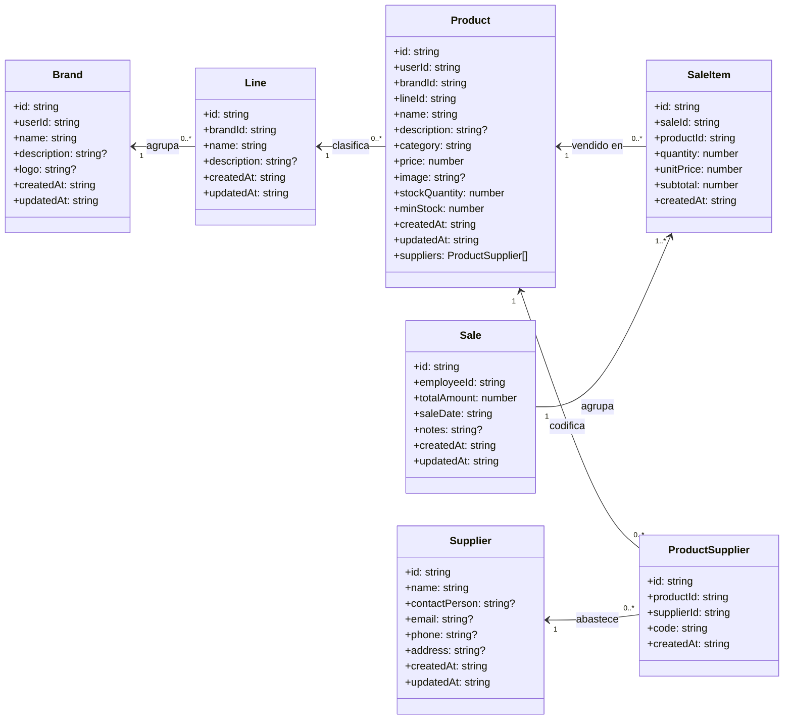
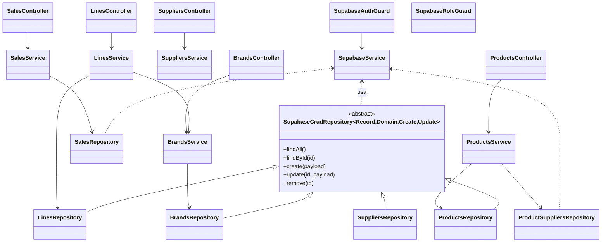

# Diagrama de clases y arquitectura

## Modelo de dominio

**Relaciones clave**
- Cada linea pertenece a una marca y su nombre es unico dentro de esa marca.
- Un producto debe indicar obligatoriamente linea y marca; los DTO permiten adjuntar `newBrand` y `newLine` para crearlos en el mismo flujo.
- `ProductSupplier` modela la relacion N a N entre productos y proveedores, almacenando el codigo propio de cada proveedor.
- El umbral de stock (`minStock`) vive en `Product` y ahora siempre se normaliza a cero si no se especifica.

## Capas de aplicacion y acceso a datos

**Como leer el diagrama**
- Los controladores siguen el patron controlador -> servicio -> repositorio; `ProductsService` ahora orquesta creacion de marca y linea cuando se envian `newBrand`/`newLine` y sincroniza proveedores via `ProductSuppliersRepository`.
- `LinesService` exige que la linea pertenezca a una marca existente y valida la unicidad (nombre + marca).
- El modulo de ventas agrega `SalesService.getSummaryMetrics` y `getMonthlyMetrics`, que aprovechan `SalesRepository.findMetricsData` para devolver KPI filtrables.