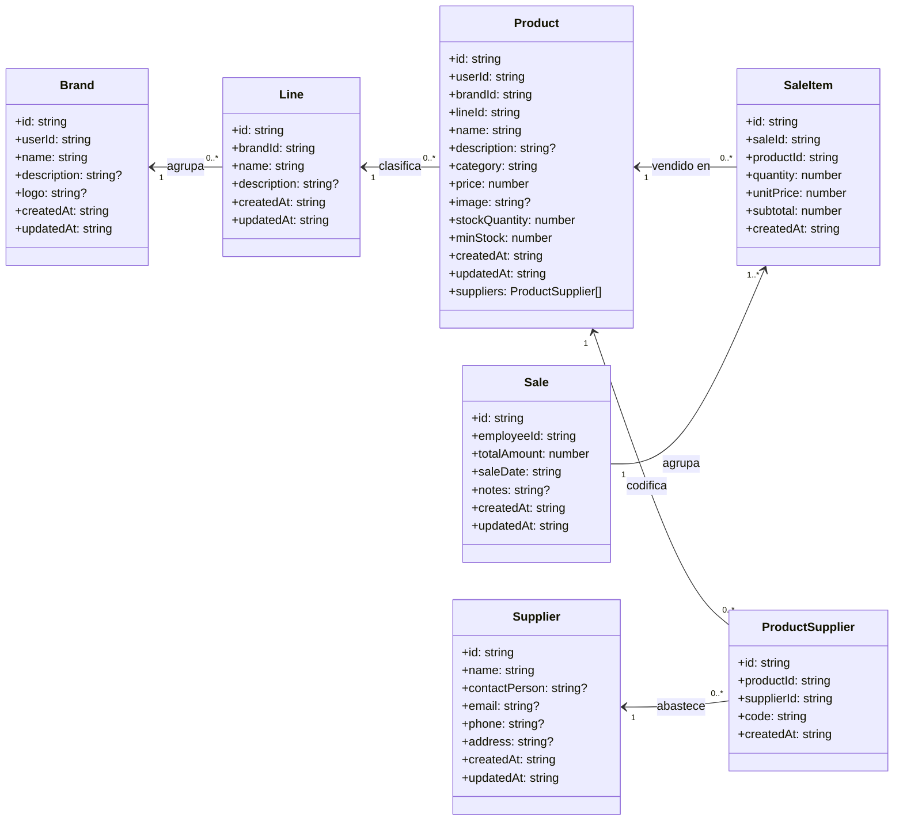
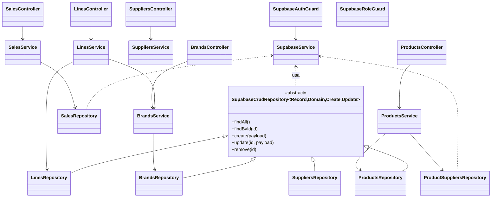

# Diagrama de clases y arquitectura

## Modelo de dominio



**Relaciones clave**
- Cada linea pertenece a una marca y su nombre es unico dentro de esa marca.
- Un producto debe indicar obligatoriamente linea y marca; los DTO permiten adjuntar `newBrand` y `newLine` para crearlos en el mismo flujo.
- `ProductSupplier` modela la relacion N a N entre productos y proveedores, almacenando el codigo propio de cada proveedor.
- El umbral de stock (`minStock`) vive en `Product` y ahora siempre se normaliza a cero si no se especifica.

## Capas de aplicacion y acceso a datos



**Como leer el diagrama**
- Los controladores siguen el patron controlador -> servicio -> repositorio; `ProductsService` ahora orquesta creacion de marca y linea cuando se envian `newBrand`/`newLine` y sincroniza proveedores via `ProductSuppliersRepository`.
- `LinesService` exige que la linea pertenezca a una marca existente y valida la unicidad (nombre + marca).
- El modulo de ventas agrega `SalesService.getSummaryMetrics` y `getMonthlyMetrics`, que aprovechan `SalesRepository.findMetricsData` para devolver KPI filtrables.

## Endpoints nuevos o extendidos
- `POST /api/products`: acepta `newBrand`, `newLine` y `suppliers` (con `supplierId` + `code`). Se normaliza `minStock` a `0` si no se envia.
- `GET /api/products/low-stock`: devuelve productos con `stockQuantity <= minStock` usando `0` como valor por defecto.
- `GET /api/sales/metrics/summary`: responde con totales, top de marcas y productos; admite filtros por fecha, producto, marca, linea y proveedor.
- `GET /api/sales/metrics/monthly`: entrega serie mensual (revenue, unidades y ordenes) con los mismos filtros opcionales.

## Cambios de esquema sugeridos (Supabase)
Aplica los ajustes ejecutando las sentencias equivalentes en tu instancia:

```sql
-- 1. Lineas referencian a marcas y el nombre es unico dentro de la marca
alter table lines
  add column if not exists brand_id uuid references brands(id) on delete restrict;
update lines set brand_id = (select brand_id from products where products.line_id = lines.id limit 1)
  where brand_id is null; -- ajusta segun tus datos
alter table lines alter column brand_id set not null;
create unique index if not exists lines_brand_name_unique
  on lines (brand_id, lower(name));

-- 2. Productos requieren linea
alter table products
  alter column line_id set not null;

-- 3. Tabla de proveedores por producto
create table if not exists product_suppliers (
  id uuid primary key default uuid_generate_v4(),
  product_id uuid not null references products(id) on delete cascade,
  supplier_id uuid not null references suppliers(id) on delete restrict,
  code text not null,
  created_at timestamp with time zone default now()
);
create unique index if not exists product_suppliers_product_supplier_unique
  on product_suppliers (product_id, supplier_id);
create unique index if not exists product_suppliers_product_code_unique
  on product_suppliers (product_id, lower(code));
```

Asegurate de actualizar datos existentes antes de imponer los `not null` o las claves unicas (por ejemplo asignando `brand_id` a las lineas y `line_id` a los productos historicos).

## Consideraciones para el frontend
- El formulario de producto puede enviar `brandId` o `newBrand`, y `lineId` o `newLine`; nunca ambos a la vez.
- La seccion de proveedores envia `suppliers: [{ supplierId, code }]`, y el backend valida unicidad de `supplierId` y `code` por producto.
- Las vistas del dashboard pueden usar los nuevos endpoints de metricas para poblar tarjetas, tablas top y graficas mensuales.

## Consideraciones adicionales
- Los guardias globales (`SupabaseAuthGuard`, `SupabaseRoleGuard`) ahora usan un `AuthenticatedRequest` tipado para exponer `user`, `authToken`, `profile` y `userRole` sin recurrir a `any`.
- El filtro de excepciones devuelve siempre JSON consistente, incluso para errores no controlados, facilitando su consumo desde el frontend.
- Repositorios genéricos y específicos encapsulan el casting de resultados Supabase (`unknown as DomainRecord`) antes de mapear al dominio, evitando errores de tipos en tiempo de compilación.
